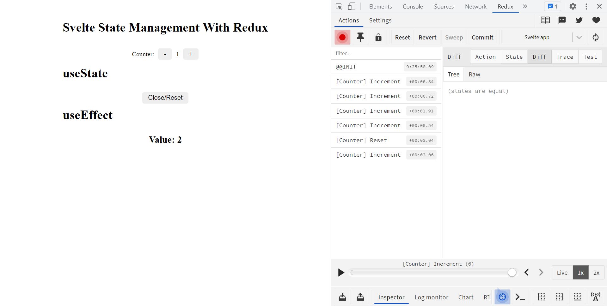

# Svelte Redux Store

Use svelte with redux store. look like react-redux

## Install

Create new app (If you use in your template. Please see note in below)

```bash
npx degit vanzinvestor/svelte-typescript-template svelte-typescript-redux-app
cd svelte-typescript-redux-app
```

Install svelte-redux-store package

```bash
npm install svelte-redux-store
```

Install redux package

```bash
npm install redux redux-devtools-extension redux-thunk
```

## Use

### Step 1 Create svelte redux store

```ts
// src/store/store.ts
import { applyMiddleware, createStore, type Middleware } from 'redux';
import { composeWithDevTools } from 'redux-devtools-extension';
import thunk from 'redux-thunk';
import rootReducers from './reducers';
import { creatSvelteReduxStore } from 'svelte-redux-store'; //import this line

export type AppState = ReturnType<typeof rootReducers>;

const initialState = {};

const middleware: Middleware[] = [thunk];

const devTools =
  process.env.NODE_ENV === 'production'
    ? applyMiddleware(...middleware)
    : composeWithDevTools(applyMiddleware(...middleware));

const store = createStore(rootReducers, initialState, devTools);

// create svelte redux store
export const {
  useStore,
  useDispatch,
  useSelector,
  useFeatureSelector,
  useSubscribe,
} = creatSvelteReduxStore<AppState>(store);
```

### Step 2 Create counter action type

```ts
// src/store/actions/couter.actions.ts
export enum CountActionTypes {
  COUNTER_INCREMENT = '[Counter] Increment',
  COUNTER_DECREMENT = '[Counter] Decrement',
}

export interface CounterIncrementAction {
  readonly type: CountActionTypes.COUNTER_INCREMENT;
}

export interface CounterDecrementAction {
  readonly type: CountActionTypes.COUNTER_DECREMENT;
}

export type Action = CounterIncrementAction | CounterDecrementAction;
```

### Step 3 Create counter creator

```ts
// src/store/creators/couter.creators.ts
import type { Dispatch } from 'redux';
import { Action } from './../actions/couter.actions';

export const increment = () => async (dispatch: Dispatch<Action>) => {
  dispatch({ type: CountActionTypes.COUNTER_INCREMENT });
};

export const decrement = () => async (dispatch: Dispatch<Action>) => {
  dispatch({ type: CountActionTypes.COUNTER_DECREMENT });
};
```

### Step 4 Create counter reducer

```ts
import { Action, CountActionTypes } from './../actions/couter.actions';

// src/store/reducers/couter.reducer.ts
interface CountState {
  count: number;
}

const initialCounterState: CountState = {
  count: 0,
};

export const counterReducer = (
  state: CountState = initialCounterState,
  action: Action
): CountState => {
  switch (action.type) {
    case CountActionTypes.COUNTER_INCREMENT:
      return { ...state, count: state.count + 1 };

    case CountActionTypes.COUNTER_DECREMENT:
      return { ...state, count: state.count - 1 };

    default:
      return state;
  }
};
```

### Step 5 Create root reducer

```ts
// src/store/reducers/index.ts
import { combineReducers } from 'redux';
import { counterReducer } from './counter.reducer';

const rootReducers = combineReducers({
  counts: counterReducer,
});

export default rootReducers;
```

### Step 6 Use in components (App.svelte)

```svelte
// src/App.svelte
<script lang="ts">
  import { increment, decrement } from './store/creators';
   import { useDispatch,useSelector, useStore, useSubscribe, type AppState } from './store/store';
  const store = useStore();
  // const dispatch = useDispatch();

  const decrement = () => {
    store.dispatch(decrement());
    // dispatch(decrement());
  };

  const increment = () => {
    store.dispatch(increment());
    // dispatch(increment());
  };

  const count = store.selector((state: AppState) => state.counts.count);

  // const count = useSelector((state: AppState) => state.counts.count);

  // let count:number
  // store.subscribe((state:AppState) => { count = state.counts.count })

  // let count:number
  // useSubscribe((state:AppState) => { count = state.counts.count })
</script>

<div class="app">
  <div class="home">
    <h1>Svelte State Management With Redux</h1>
    <div class="list">
      <div class="list-item">
        <p>Counter:</p>
        <div class="btn-group">
          <button class="btn" on:click={decrement}> - </button>
          <!-- USE SELECTOR -->
          <p>{$count}</p>
          <!-- USE SUBSCRIBE -->
          <!-- <p>{count}</p> -->
          <button class="btn" on:click={increment}> + </button>
        </div>
      </div>
    </div>
  </div>
</div>

<style type="scss">
  .app {
    display: flex;
    justify-content: center;
    margin-top: 50px;
  }
  .home {
    display: flex;
    justify-content: center;
    flex-direction: column;
  }

  .list {
    display: flex;
    flex-direction: column;
    justify-content: center;
    align-items: center;
    margin-top: 20px;
  }

  .list-item {
    display: flex;
    flex-direction: row;
    align-items: center;
    padding: 10px;
  }

  .btn-group {
    display: flex;
    flex-direction: row;
    align-items: center;
    margin-left: 10px;
  }

  .btn-group p {
    padding: 10px;
  }

  .btn {
    padding: 5px 15px;
    font-size: 1rem;
    border: none;
    outline: none;
    background-color: #eee;
    border-radius: 5px;
    cursor: pointer;
  }

  .btn:hover {
    background-color: #ccc;
    transition: all 0.3 ease-in-out;
  }

  .btn:disabled {
    background-color: #f2f2f2;
    pointer-events: none;
  }
</style>
```

### Step 7 Install Redux DevTools Extension (Chrome Browser)

[Redux DevTools](https://chrome.google.com/webstore/detail/redux-devtools/lmhkpmbekcpmknklioeibfkpmmfibljd])

### Step 8 Chrome Browser And Press F12 (Developer tools) and See Redux tab



## Example App

[Counter App](https://github.com/vanzinvestor/example-svelte-redux-store-counter-app)

## Note: Make svelte support Redux

Install replace package

```bash
npm install @rollup/plugin-replace
```

Change `rollup.config.js`

```js
// rollup.config.js
import replace from '@rollup/plugin-replace'; // Import this

export default {
  // ...
  plugins: [
    // ...
    // Add this
    replace({
      preventAssignment: true,
      'process.env.NODE_ENV': production
        ? JSON.stringify('production')
        : JSON.stringify('development'),
    }),
    // ...
  ],
  // ...
};
```

## Inspire by

[react-redux](https://github.com/reduxjs/react-redux)
[ngrx](https://github.com/ngrx/platform/tree/master/modules/store)
